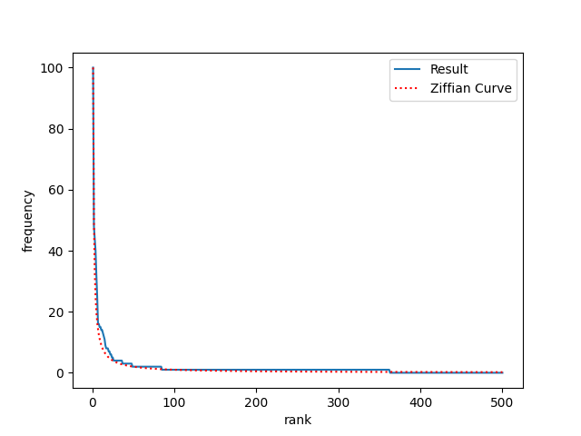

# Лабораторная работа №2 «Закон Ципфа»

В ходе выполнения лабораторной работы был построен график распределения терминов по частотностям в логарифмической шкале для тестового корпуса, который сравнивается с графиком закона Ципфа.

